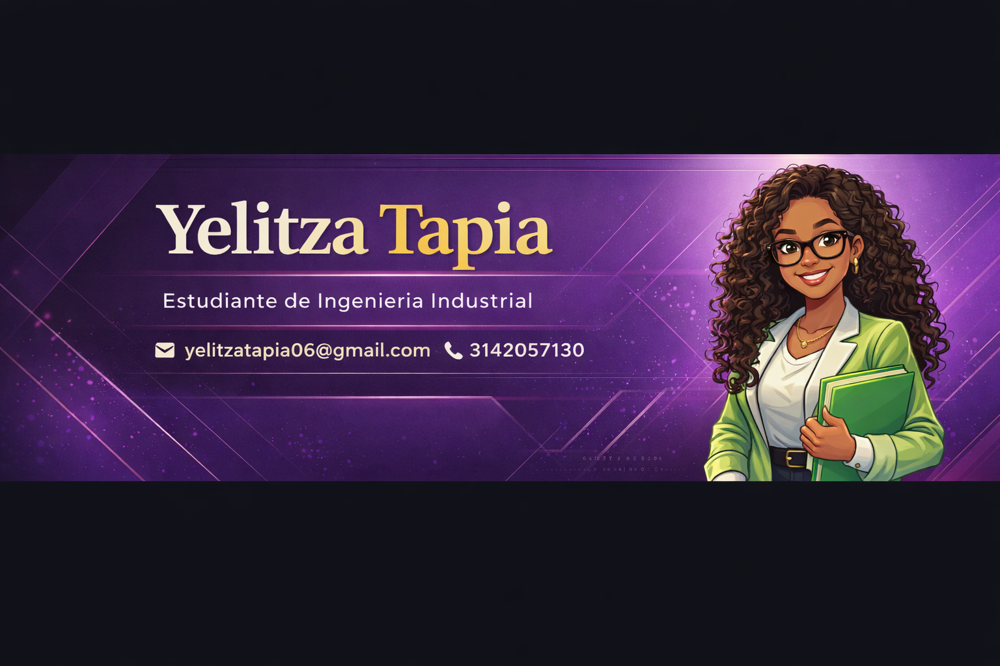

  

<h1 align="center"> Hola, soy Yelitza Tapia 😊</h1>
<h3 align="center">Estudiante de Ingeniería Industrial | Apasionada por las finanzas, el liderazgo y el crecimiento personal</h3>

### 📊 Data & Engineering Stack

## ✨ Sobre mí

Hola, soy **Yelitza Tapia**, estudiante de **Ingeniería Industrial** y una persona que siempre está buscando crecer, aprender y asumir nuevos retos.  
Me considero alguien muy comprometida con lo que hace, con una gran capacidad para adaptarse, trabajar en equipo y liderar cuando es necesario.

Siento que una de las cosas que más me define es que **nunca me quedo quieta**. Siempre estoy buscando qué hacer, cómo aportar, cómo mejorar y cómo seguir avanzando. Para mí, crecer no es solo obtener conocimientos, sino también desarrollar una mentalidad fuerte, disciplinada y con visión.

---

## 🎯 Mi objetivo profesional

Mi meta es desarrollarme en el área de **finanzas** dentro de una empresa grande o multinacional, donde pueda fortalecer mis conocimientos, adquirir experiencia y aportar valor a través del análisis, la organización y la toma de decisiones.

A futuro, me visualizo ocupando un rol de liderazgo, idealmente como **gerente del área financiera**, guiando equipos, proponiendo mejoras y participando en decisiones importantes que ayuden al crecimiento de la organización.

---

## 📚 Formación académica

### 🎓 Ingeniería Industrial  
**Estudiante universitaria**  
Actualmente en formación académica, fortaleciendo conocimientos en áreas como:

- Gestión de procesos
- Productividad y eficiencia
- Análisis de datos
- Estadística
- Investigación de operaciones
- Mejora continua
- Planeación y optimización de recursos

---

## 💼 Intereses profesionales

Actualmente me interesa seguir aprendiendo y creciendo en temas como:

- Finanzas empresariales
- Análisis financiero
- Gestión estratégica
- Toma de decisiones basada en datos
- Productividad y optimización de procesos
- Liderazgo de equipos
- Mejora continua
- Innovación en organizaciones

---

## 🧠 Habilidades personales

Estas son algunas habilidades que considero importantes en mi forma de trabajar y relacionarme con los demás:

- Liderazgo
- Empatía
- Responsabilidad
- Trabajo en equipo
- Perseverancia
- Proactividad
- Comunicación asertiva
- Adaptabilidad
- Organización
- Disciplina
- Resolución de problemas
- Aprendizaje constante

---

## 🛠️ Herramientas y conocimientos en formación

Actualmente sigo fortaleciendo mis habilidades en herramientas y recursos que pueden aportar mucho a mi perfil profesional:

- Microsoft Excel
- Microsoft Word
- Microsoft PowerPoint
- Canva
- GitHub (aprendiendo y explorando)
- Análisis de datos (nivel inicial / en formación)
- Organización de proyectos
- Presentaciones académicas y profesionales

---

## 🚀 Experiencias y participación

A lo largo de mi proceso académico y personal, me ha gustado participar en espacios donde pueda aportar, aprender y desarrollar habilidades más allá del aula.

Me interesa involucrarme en actividades que me permitan:

- Asumir responsabilidades
- Trabajar con otras personas
- Organizar ideas y tareas
- Liderar pequeños procesos o equipos
- Aprender de nuevos retos
- Fortalecer mi seguridad y mi comunicación

Considero que cada experiencia, por pequeña que parezca, suma al crecimiento de una persona y ayuda a construir un perfil más integral.

---

## 🌱 Mi forma de ver el crecimiento

Creo mucho en el crecimiento constante.  
No me gusta quedarme solo con lo básico ni conformarme con lo que ya sé. Siempre trato de buscar nuevas oportunidades, aprender de cada experiencia y convertirme en una mejor versión de mí misma.

Para mí, avanzar significa:

- Tener disciplina incluso cuando cuesta
- Aprender de los errores
- Ser valiente para asumir nuevos retos
- Mantener una visión clara de lo que quiero construir
- No rendirme fácilmente

---

## 🌍 Idiomas

- **Español:** Nativo
- **Inglés:** Nivel básico (A2) y en proceso de mejora

---

## 📌 Actualmente enfocada en

En este momento estoy enfocada en:

- Seguir fortaleciendo mi formación como estudiante de Ingeniería Industrial
- Aprender más sobre el área financiera
- Desarrollar habilidades en análisis de datos
- Mejorar mi perfil profesional poco a poco
- Participar en retos y oportunidades que me ayuden a crecer
- Construir bases sólidas para mi futuro laboral

---

## 💡 Algo que me representa

> *"No me gusta quedarme quieta. Siempre estoy buscando cómo aprender, cómo mejorar y cómo salir adelante."*

---

## 📫 Contacto

- **GitHub:** [github.com/yelitizasT](https://github.com/yelitizasT)
- **LinkedIn:** *(puedes agregarlo aquí si tienes uno)*
- **Correo:** *(puedes agregar tu correo aquí si quieres)*

---

## ⭐ Nota final

Este espacio representa una parte de quién soy hoy: una estudiante con metas claras, con muchas ganas de aprender, de crecer y de construir un futuro profesional sólido.  
Sé que todavía estoy en proceso, pero también sé que la constancia, la actitud y la visión hacen una gran diferencia.
